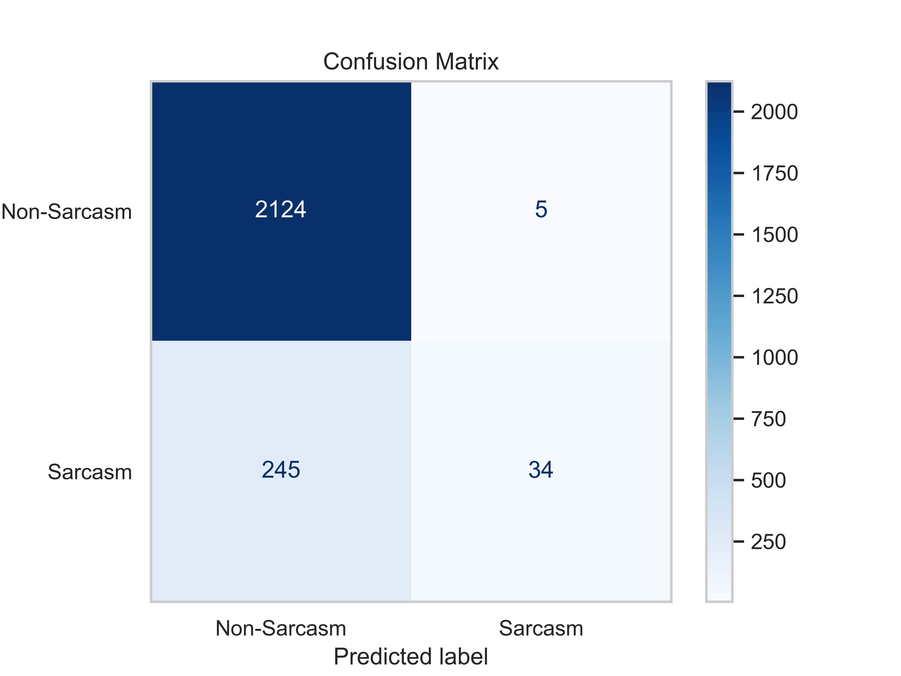
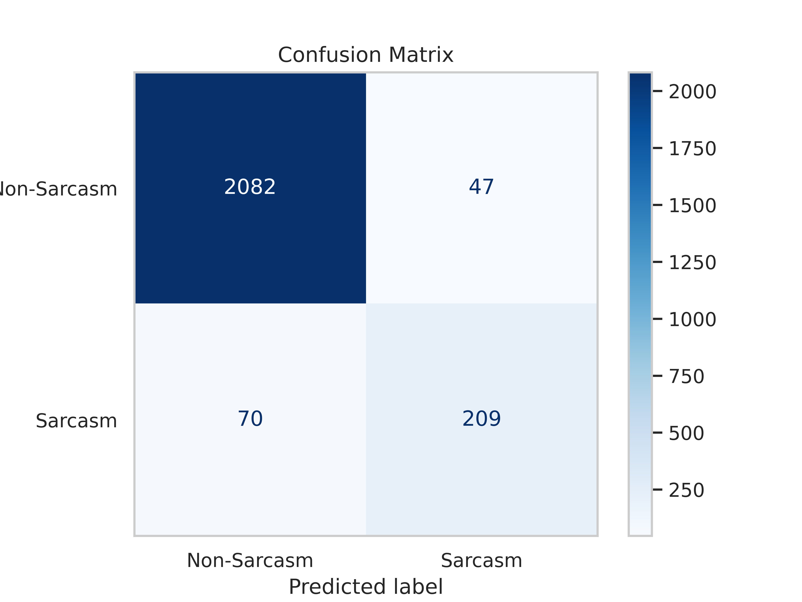

# Arabic Sarcasm Detection

Arabic Sarcasm Supervised Modeling for The WANLP Sarcasm Dataset V2.

## Dataset

The [dataset](https://github.com/iabufarha/ArSarcasm-v2) comes from the [WANLP Sarcasm competition](https://aclanthology.org/2021.wanlp-1.36/). The dataset consists of tweets annotated on sarcasm, sentiment, and dialect levels. Initially, the dataset is noisy, containing wrongly labeled examples. The model is only intended to be used in a working environment and not benchmarked against the test dataset. For that reason, we clean the labeling issues in the training and testing sets.

## Label Cleansing

In order to train a robust model, we utilized the [CleanLab](https://github.com/cleanlab/cleanlab) framework to detect labeling issues in the datasets and drop them. We utilized the [MarBERT](https://huggingface.co/UBC-NLP/MARBERT) Arabic Transformer model as a text encoder to extract the input features using the [SentenceTransformer](https://www.sbert.net/) framework. We, also, trained a dummy logistic regression model to predict the soft-labels (logits) needed for CleanLab to find the labeling issues. The logits and input features are the inputs to the CleanLab **DataLab** object to detect the labeling issues (wrongly labeled examples) and outlier examples (probably belonging to a non-existing class). Dropping these issues altogether produces a clean dataset. We performed the cleaning process for 8 iterations till the issues almost vanished.

## Baseline Model (Logistic Regression)

We trained a baseline model **Logistic Regression** on the cleaned data and obtained a 21 F1 score on the sarcasm class on a held-out test set. The confusion matrix for the baseline is attached as follows.

## MarBERT Sarcasm Transformer Model

As our end model, we trained a **MarBERT** sequence classifier model to classify tweets as _Sarcasm_ and _Non-Sarcasm_. The transformer model obtained a 77.86 F1 score on the sarcasm class on the same held-out test set used for the baseline model.

Note: again! the reported results are all on a cleaned test set, not the same as the benchmark, and don't contain label issues (almost). This is valid since this model will be used in a working environment rather than benchmarking.

The confusion matrix for the transformer is attached as follows.

## Notes

- The dataset has an imbalanced class distribution. To maximize the performance of the baseline and the transformer model, we used a weighted loss to amplify the learning signal for the minority class (sarcasm).
- We present our model as open source software (OSS) on the [HuggingFace Hub](https://huggingface.co/) with the name [Bmalmotairy/marbert-finetuned-wanlp_sarcasm](https://huggingface.co/Bmalmotairy/marbert-finetuned-wanlp_sarcasm). Feel free to use it and send us any feedback whenever possible.
